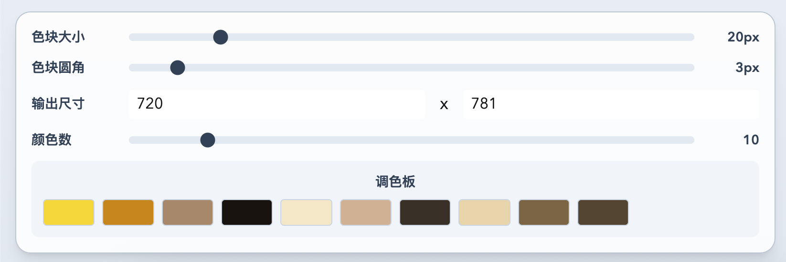

# Mosaic Generator

An offline web app built with Node.js, Vite, TypeScript, Tailwind CSS, and daisyUI.

## Features

- Upload a local image
- Configure parameters:
  - Mosaic block size
  - Block corner radius
  - Palette color count
  - Output width and height
- Generate mosaic image locally in the browser
- Download generated PNG image
- Responsive layout (mobile-first)




## Tech Stack

- Node.js
- Vite
- React + TypeScript
- Tailwind CSS + daisyUI
- Canvas-based image processing (K-means palette + block rendering)
- Service Worker for offline app-shell caching

## Run

```bash
npm install
npm run dev
```

## Build

```bash
npm run build
npm run preview
```

## Offline Notes

- App shell is cached after first successful load.
- Once cached, the app can open and run without network.
- Image processing is local-only and never uploaded.
